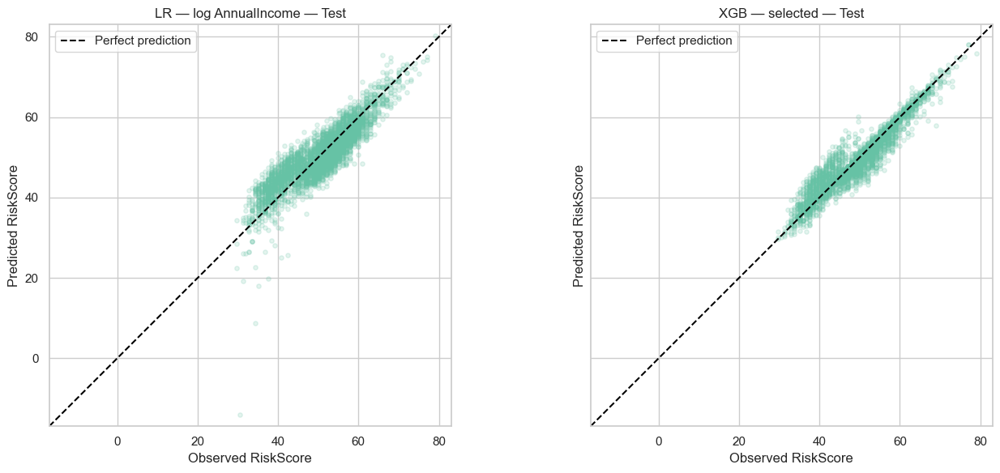
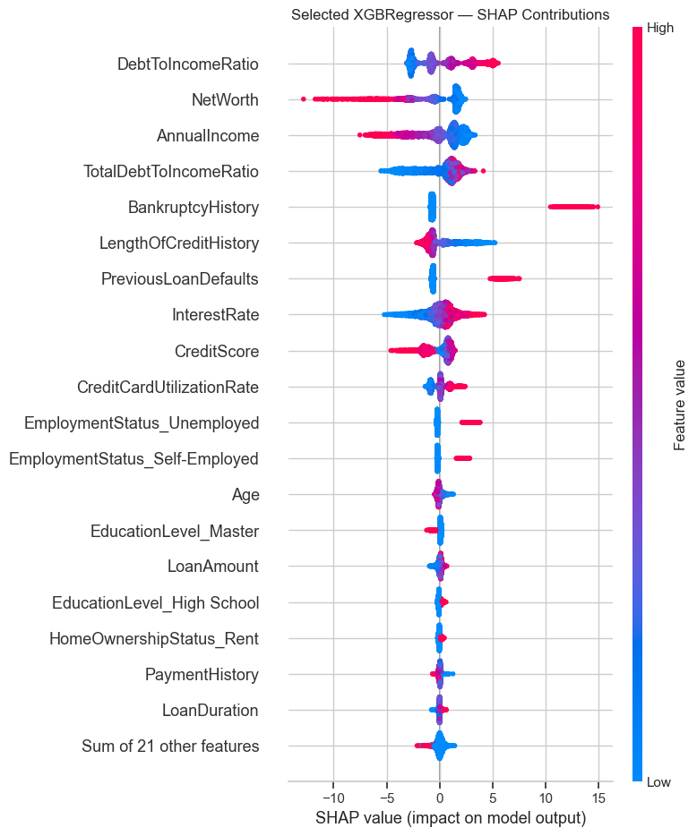

# Credit Risk Score Prediction

**Linear Regression vs. XGBoost, with regression diagnostics and SHAP explanations.**

This project predicts a numerical `RiskScore` from applicant and loan information. It compares an interpretable linear benchmark with a tuned tree ensemble, evaluates both on a held-out test set, and investigates where their predictions fail.

**Main result:** selected XGBoost achieves test **MAE 1.5305**, **RMSE 2.3613**, and **R² 0.9102**. Compared with the selected Linear Regression, test MAE decreases by **46.94%** and RMSE by **35.39%**.

> The dataset is synthetic. Predicting its RiskScore is a regression task, not estimating a calibrated probability of default or validating a model for lending decisions.

[Open the full analysis](Notebook.ipynb)

## Test results

All models are evaluated on the same 4,000 test observations using their fixed training-fitted preprocessing and parameters.

| Model | MAE ↓ | RMSE ↓ | R² ↑ |
|---|---:|---:|---:|
| Training-mean baseline | 6.2114 | 7.8874 | −0.0020 |
| Original Linear Regression | 2.9166 | 3.7902 | 0.7686 |
| Linear Regression — log AnnualIncome | 2.8845 | 3.6549 | 0.7848 |
| **Selected XGBoost** | **1.5305** | **2.3613** | **0.9102** |

MAE and RMSE are measured in RiskScore points. R² is a regression score, not classification accuracy.



XGBoost also reduces median absolute test error from **2.5073** to **0.7522**, and maximum absolute test error from **44.5208** to **10.9848**. MAE and RMSE improve in all evaluated target-score bands, although performance remains uneven and the ≥70 band contains only 34 test observations.

## Data

- Source: [Financial Risk for Loan Approval — Kaggle](https://www.kaggle.com/datasets/lorenzozoppelletto/financial-risk-for-loan-approval), published by Lorenzo Zoppelletto.
- 20,000 records and 36 original columns.
- Target: `RiskScore`.
- Inputs include income, debt ratios, credit history, employment, and proposed loan terms.
- No pandas-recognized missing values were found.

`Loan.csv` is included beside `Notebook.ipynb` so that the analysis can be run without a separate download. The dataset was published by Lorenzo Zoppelletto on Kaggle; its source and applicable dataset terms remain those of the original publication.

## Methodology

1. **Explore the data:** target and predictor distributions, categorical comparisons, and correlations.
2. **Split before learned preprocessing:** 60% training (12,000), 20% validation (4,000), and 20% test (4,000), using random seed 42.
3. **Prepare predictors:** exclude `ApplicationDate` and `LoanApproved`; fit categorical encoding on training only. VIF assessment leads to common exclusions of `BaseInterestRate`, `MonthlyIncome`, `TotalAssets`, and `Experience`, leaving 40 encoded predictors.
4. **Develop Linear Regression:** standardize 24 numerical predictors, leave 16 dummy predictors unchanged, and compare against a training-mean baseline. Diagnose functional form, error variance, residual tails, and influence. Use HC3 standard errors and Benjamini–Hochberg adjustment for exploratory coefficient inference.
5. **Compare limited transformations:** retain `log1p(AnnualIncome)` based on validation results and a five-fold training CV comparison. Keep the original regression as a reference; do not remove observations automatically.
6. **Tune XGBoost:** evaluate 25 configurations using five-fold CV on training, fitting the encoder separately within each fold. Select by mean held-out MAE, then assess validation errors and boosting curves.
7. **Explain predictions:** inspect an individual tree, split-gain importance, global SHAP contributions, and a previously investigated validation case.
8. **Evaluate once specifications are fixed:** compare test predictions, overall metrics, error tails, target-score bands, and validation-to-test changes.

CV preprocessing is fitted within folds. Predictor exclusions are held fixed after the initial training assessment; CV therefore does not independently validate the entire feature-selection process.

## Selected XGBoost configuration

| Parameter | Value |
|---|---:|
| `n_estimators` | 900 |
| `learning_rate` | 0.05 |
| `max_depth` | 5 |
| `min_child_weight` | 5 |
| `subsample` | 0.8 |
| `colsample_bytree` | 1.0 |
| `reg_alpha` | 0.1 |
| `reg_lambda` | 1.0 |

The selected configuration achieves mean CV MAE **1.5034**, compared with **1.7398** for the initial configuration on the same folds. Its training MAE (**0.7160**) is substantially lower than validation MAE (**1.4590**), so a generalization gap remains. Test MAE is **1.5305**. This is the best configuration evaluated by the specified criterion, not a claim of global optimality.

## Interpretation

DebtToIncomeRatio, NetWorth, and AnnualIncome have the largest mean absolute SHAP contributions across validation observations. Higher debt-to-income ratios generally increase predictions, while higher income and net worth generally decrease them.



For validation observation 168, XGBoost reduces absolute error from **33.3356** to **8.8268** points. SHAP reconstructs its prediction from a baseline of **50.8157** plus contributions totaling **0.4111**. The large negative NetWorth contribution is largely offset by positive contributions from previous defaults and other predictors.

SHAP explains the fitted model under its attribution assumptions. It does not establish causal effects; correlated predictors can share contributions. Additional [SHAP importance](assets/shap_importance.png) and [tree illustration](assets/boosting_tree.png) are available.

## Run the analysis

Use Python **3.11**, matching the notebook's recorded Python version. The recorded XGBoost version is **3.2.0**.

```bash
git clone https://github.com/MatteoGiuseppetti/Credit_Scoring.git
cd Credit_Scoring
python -m venv .venv
```

Activate the environment:

```bash
# Windows PowerShell
.venv\Scripts\Activate.ps1

# macOS / Linux
source .venv/bin/activate
```

Install dependencies and open the notebook:

```bash
python -m pip install -r requirements.txt
python -m jupyter lab Notebook.ipynb
```

The included `Loan.csv` is already in the repository root. Select the environment's Python kernel and run all cells from the beginning. The notebook includes 125 CV fits plus the selected-model refit, so execution time depends on hardware. Saved outputs allow reading the analysis without running it.

The dependency file declares the required packages and pins the recorded XGBoost version. It is not a complete lockfile of the original environment; results can vary slightly with other package versions and platforms.

## Repository contents

- [`Notebook.ipynb`](Notebook.ipynb): analysis, code, diagnostics, figures, and saved results.
- [`Loan.csv`](Loan.csv): the synthetic source dataset used in the analysis.
- [`requirements.txt`](requirements.txt): Python dependencies.
- [`assets/`](assets/): exported notebook figures used in this README.
- [`.gitignore`](.gitignore): other CSV files, local environments, and notebook checkpoints excluded from Git; `Loan.csv` is explicitly retained.

## Limitations

- Synthetic scores do not establish predictive validity for real borrowers or observed default outcomes.
- The random split assesses held-out records from this dataset, not future applications. The artificial date range does not provide a meaningful deployment timeline.
- Retaining `InterestRate`, `MonthlyLoanPayment`, and `TotalDebtToIncomeRatio` assumes proposed loan terms are available before final approval. The documentation does not verify their independence from risk assessment.
- The selected regression retains heteroscedasticity, tail errors, and moderate collinearity. HC3 inference does not correct dependence, model misspecification, or selection uncertainty.
- XGBoost remains imperfect, particularly in some score ranges. Interpretations describe model behavior rather than causal borrower effects.

## Author

[Matteo Giuseppetti](https://github.com/MatteoGiuseppetti)
